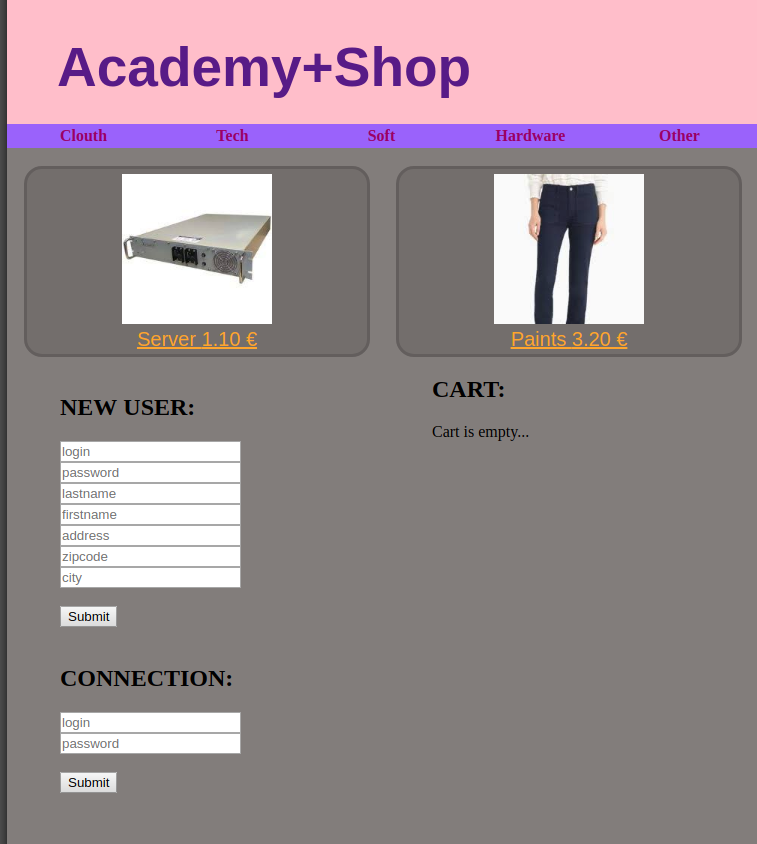

<H2> Pure PHP (Core) website. Dobos P. </H2>
<H3> Mini e-commerce website. (group project)</H3>

1.  Setup mysql database acces for user,

2 . Run php install.php on server side, it will migrate an demo DB;

3 . log in as root : password

