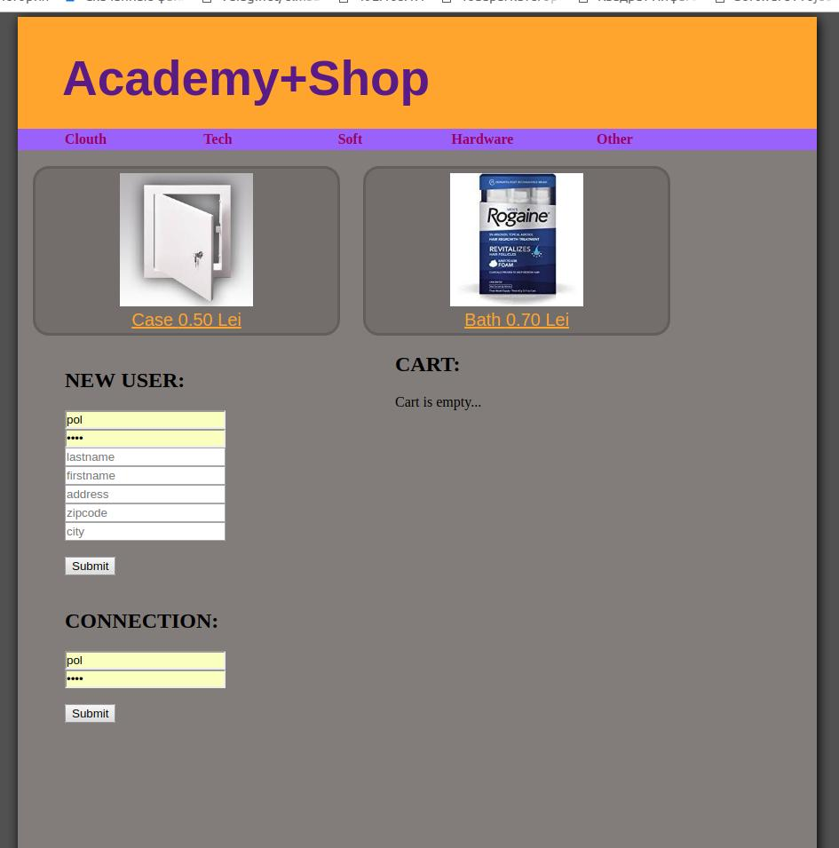
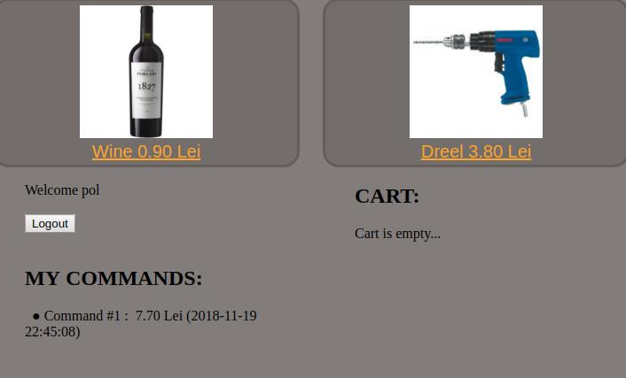

<H2> Simple PHP (Core) website. Dobos P. </H2>
<H3> Mini e-commerce website. PHP+MySQL (group project)  
No OOP, No MVC, NoFramework and 3rd party JS, CSS; </H3>

1.  Setup mysql database acces for user,

2 . Run php install.php on server side, it will migrate an demo DB;

3 . log in as root : password, chech info.php for global variabe and delete it from server side.

<h2> There some modification was made by me in branch STG: </h2>

 

Commands page with show what logged user have in chart

Route can be modified by this whay to show how thy can be modefied.

